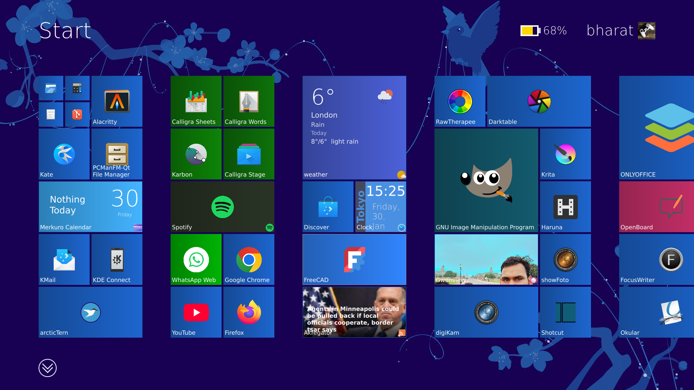
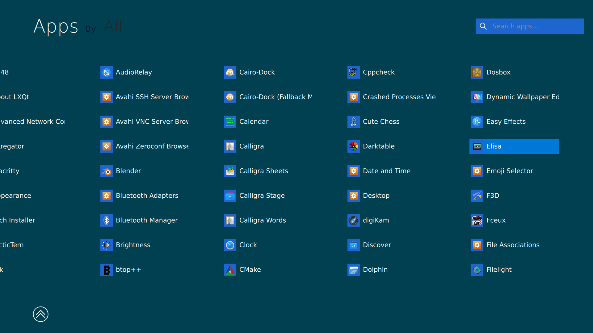
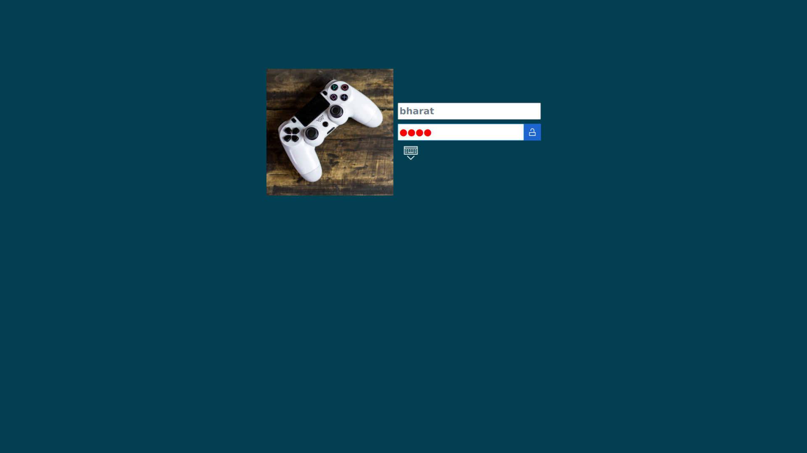
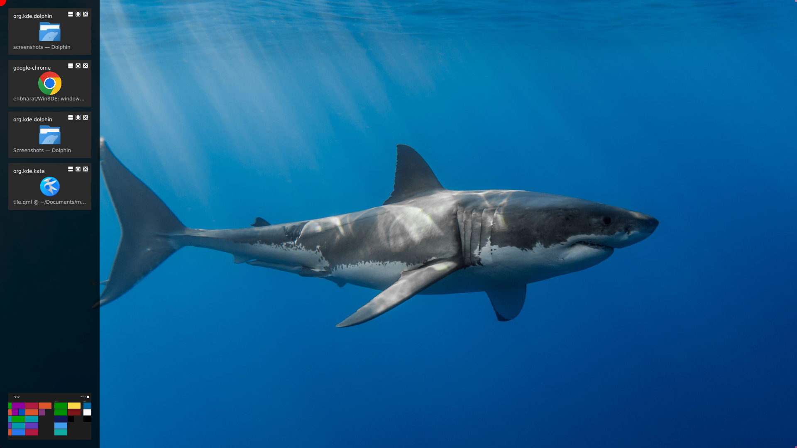
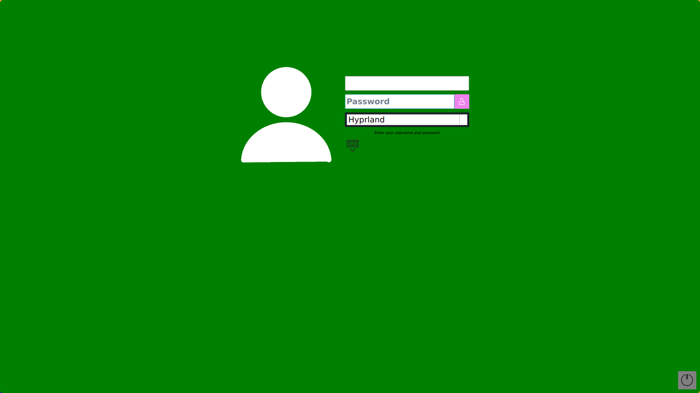

# Windows 8 revival on Linux.

If you are one of who enjoyed the windows 8 and miss its fluid animations but have since moved to linux.
And cant go back to windows 8, because all apps are non functional there. And if you can bear that you
cant install it on the newer hardware.
            This is for you it is a shell for wayland window managers like Labwc hyprland etc. It gives a
wallpaper utility, a lock screen, a start menu, an OSD for volume and brightness a settins app for wall.
it dosent provide charms menu because i always thought its useless.

## Screenshots

## Features
---
### Start
1. one command Win8Start to show hide start menu can be bound to super of compositor.
2. full drag and drop support of start tiles and sizes small medium large xlarge gui way right click.
3. can drag from all apps to tiles.
4. search of apps functional.
5. drag app from all apps to botom to hide start screen and put icon any where that supports like desktop.
6. get power menu by clicking user icon.
7. have battery osd in it.

#### live tiles  
 - supports live tiles for tiles in start menu
 - just put the logic.py & or tile.qml in `.config/Win8Start/tiles/appname/tiles.qml || logic.py`
 - there is no need to install anything for it.
 - choice of python is due to non comiled nature and ease of programming.
 - qml can function without a logic.py if you know to make one use qt docs to understand it.
 

### OSD
1. Volume up down mute
2. brightness up down.
3. two part Win8OSD-server and Win8OSD-client server doesn't need to be autostarted
4. Win8OSD-client --volup voldown mute dispup dispdown

### Wall
1. simple image wallpaper supports gif
2. settable through settings
3. wallpaper gets blurred when mouse is not over it, and also gif stops playing so it dosent consume cpu.

### Lockscreen
1. windows 8 style
2. wallpaper changable by settings app
3. have nice slide down and up of lockscreen
4. dont need click and drag just click is enough unlike original

### settings
1. can change wallpaper of all 3 graphically start, wall, lock.
2. can change accent colors and background colors of start lockscreen etc.
---
## Installation ##

### dependency Arch

cmake  
gcc  
ninja  
pkgconf  

qt6-base  
qt6-declarative  
qt6-wayland  

layer-shell-qt  
wayland  
pam  
glibc  

`sudo pacman -S --needed - < dependencies.txt`

### for local binary use run

`./build.sh`

it will build all binaries and put it in "build/bin" folder you can use it in config files to autostart
and bind to system keys for brightness and volume with local location.
you can't run settings from start screen bc it uses system location so you will have to run it from binary built.
bind win/super key to Win8Start

### for system install

`./install.sh`

it will automatically run build.sh and move the binaries to "/usr/local/bin/" and will be available systemwide,
so it will be easier to put in configs and autostart

`./uninstall.sh`

it will remove binaries from `/usr/local/bin/`

## Use It Like seperate DE ##

it will use different config file so that your current config is not affected.
create a copy of config folder and paste it with diff name like labwc2 hypr2 etc.

find your compositors config loading command and make a .desktop file like this **example**.

`[Desktop Entry]`\
`Name=labwc-win8`\
`Comment=A wayland stacking compositor`\
`Exec=labwc -C /usr/share/labwc3`\
`Icon=labwc`\
`Type=Application`\
`DesktopNames=labwc;wlroots`

and **paste** it in `/usr/local/share/wayland-sessions/`

and at ***login choose this session.***

